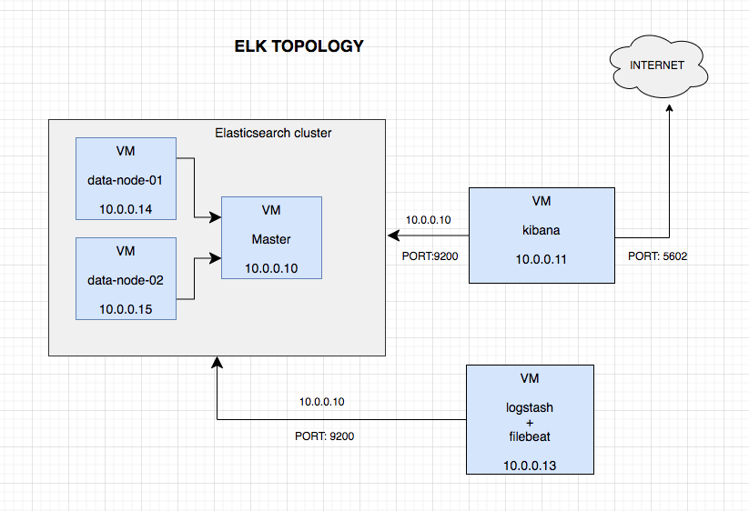

# elastic-vagrant-stack

## Common Tools


```bash
sudo yum install -y telnet vim

sudo yum -y install java-1.8.0-openjdk

cat <<EOF | sudo tee /etc/profile.d/java8.sh
export JAVA_HOME=/usr/lib/jvm/jre-openjdk
export PATH=\$PATH:\$JAVA_HOME/bin
export CLASSPATH=.:\$JAVA_HOME/jre/lib:\$JAVA_HOME/lib:\$JAVA_HOME/lib/tools.jar
EOF

source /etc/profile.d/java8.sh

rpm --import https://artifacts.elastic.co/GPG-KEY-elasticsearch

cat <<EOF | sudo tee /etc/yum.repos.d/elasticsearch.repo
[elasticsearch-7.x]
name=Elasticsearch repository for 7.x packages
baseurl=https://artifacts.elastic.co/packages/7.x/yum
gpgcheck=1
gpgkey=https://artifacts.elastic.co/GPG-KEY-elasticsearch
enabled=1
autorefresh=1
type=rpm-md
EOF

sudo yum clean all
sudo yum makecache
```

## Install ElasticSearch 7.x on ESMaster & ESData, ESData2 nodes

```bash
sudo yum -y install elasticsearch

sudo cp /vagrant/config/master-node-elasticseach.yml /etc/elasticsearch/elasticsearch.yml
sudo cp /vagrant/config/data-node-01-elasticseach.yml /etc/elasticsearch/elasticsearch.yml
sudo cp /vagrant/config/data-node-02-elasticseach.yml /etc/elasticsearch/elasticsearch.yml

sudo vim etc/elasticsearch/jvm.options

# Edit for ESMaster
# -Xms512m
# -Xmx1024m

# Edit for ESData
# -Xms512m
# -Xmx512m

# Edit for ESData2
# -Xms512m
# -Xmx512m

sudo systemctl daemon-reload
sudo systemctl enable elasticsearch
sudo systemctl start elasticsearch
```

## Install Logstash

```bash
sudo yum install -y logstash

sudo cp ./config/logstash/logstash-pipeline.conf /etc/logstash/conf.d/cluster-vagrant-pipeline.conf

sudo systemctl daemon-reload
sudo systemctl enable logstash
sudo systemctl start logstash
sudo systemctl status logstash
```

## Install Filebeat

```bash
sudo yum install -y filebeat

sudo cp ./config/filebeat/filebeat.yml /etc/filebeat/filebeat.yml

sudo systemctl daemon-reload
sudo systemctl enable filebeat
sudo systemctl start filebeat
sudo systemctl status filebeat
```

## Install Kibana

```bash
sudo yum install -y kibana

sudo cp ./config/kibana/kibana.yml /etc/kibana/kibana.yml

sudo systemctl daemon-reload
sudo systemctl enable kibana
sudo systemctl start kibana
sudo systemctl status kibana

```
